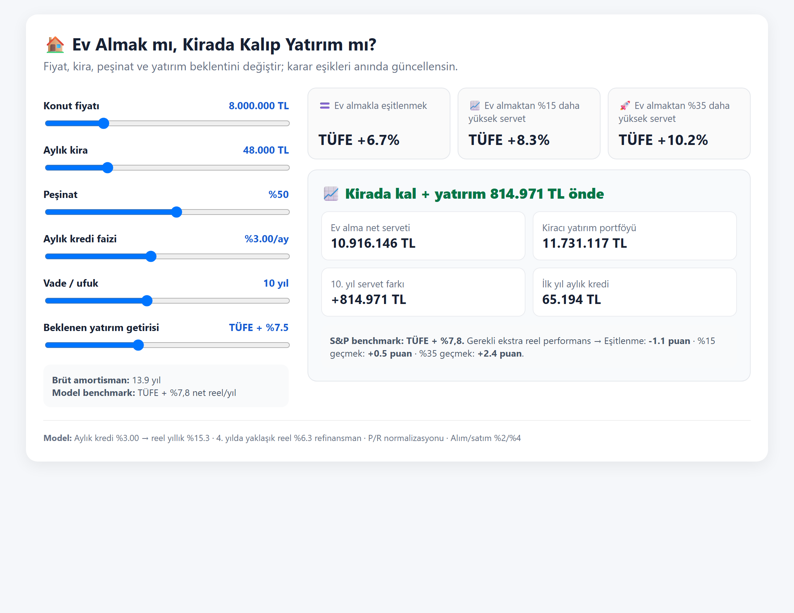

# 🏠 Turkey House Buy vs. Rent Financial Engine (AI SKILL)

A quantitative financial engine and AI agent skill that evaluates whether **buying a home** or **renting and investing the difference** (in stocks, funds, ETFs) yields greater net wealth over a default **10-year horizon**.

When a user provides a **property listing link or price/rent details**, the engine computes the exact **Hurdle Rates (`r_hurdle`)** — the annual portfolio returns (both real and nominal) a tenant must achieve to **Tie**, **Beat (+15%)**, or **Crush (+35%)** homeownership wealth.

---

## 🎮 Interactive Web Playground

> 🚀 **Live Demo:** [**Open Live Playground in Your Browser**](https://egesnr.github.io/turkey-house-buy-vs-rent-skill/)  
> *(No installation needed — runs directly in your browser)*

<p align="center">
  <a href="https://egesnr.github.io/turkey-house-buy-vs-rent-skill/">
    
  </a>
</p>

---

## 🚀 Quick Example & Real Output

### CLI Execution
```bash
python scripts/buy_vs_rent.py --price 7850000 --rent 42000 --mortgage-real 0.138
```

### Exact Output Produced by the Engine:
```text
========================================================================================
                         TÜRKİYE KONUT ALIM / KİRA ANALİZİ
========================================================================================
• Konut Fiyatı           : 7,850,000 TL       | Aylık Kira           : 42,000 TL
• Brüt Amortisman        : 15.6 Yıl           | Başlangıç Nakit      : 4,082,000 TL
• Aylık Kredi Taksiti    : 60,471 TL          | Analiz Ufku          : 10 Yıl

📊 KARAR MATRİSİ (Hurdle Rates Decision Matrix):
┌───────────────────────────┬──────────────────────┬────────────────────────┬─────────────┐
│ Hedef Senaryo             │ Gerekli Reel Getiri  │ Gerekli Nominal Getiri │ S&P 500 Ref │
├───────────────────────────┼──────────────────────┼────────────────────────┼─────────────┤
│ 1. Başa Baş (TIE)         │ TÜFE + %6.9          │ ~%13.4 Nominal         │ TÜFE +%7.8  │
│ 2. Belirgin Fark (+15%)   │ TÜFE + %8.6          │ ~%15.2 Nominal         │ TÜFE +%7.8  │
│ 3. Ezici Üstünlük (+35%)  │ TÜFE + %10.5         │ ~%17.2 Nominal         │ TÜFE +%7.8  │
└───────────────────────────┴──────────────────────┴────────────────────────┴─────────────┘

🏆 SONUÇ:
Mevcut piyasa koşullarında kiracının ev sahibini yakalaması için portföyünde
yıllık reel TÜFE + %6.9 getiri elde etmesi gerekir.
========================================================================================
```

---

## 📐 Mathematical Model & Formulas

### 1. Dynamic Real Mortgage Rate (Fisher Equation)
$$\text{Real Rate} = \frac{1 + \text{Nominal Annual Rate}}{1 + \text{Expected Inflation}} - 1$$

---

### 2. Price-to-Rent (P/R) Mean Reversion
Real estate appreciation adjusts dynamically toward historical equilibrium ($P/R_{\text{normal}} = 18.0$ years):
$$a_{\text{catchup}} = g_{\text{rent}} - \frac{1}{T_{\text{close}}} \ln\left(1 + \frac{P/R_{\text{current}}}{P/R_{\text{normal}}} - 1\right)$$
* $g_{\text{rent}}$: Real annual rent growth ($1\%/\text{year}$).
* $T_{\text{close}}$: Mean reversion convergence period (default: 7 years).

---

### 3. Dynamic Refinancing & Demand Shock Elasticity
If interest rates drop to long-term levels (e.g., Year 3 at $4\%$ real):
* **Refinanced Principal:** $B_{\text{refi}} = B_3 \cdot (1 + 0.02)$ *(incorporating the statutory 2% early settlement penalty under Turkish Law No. 6502)*.
* **Demand Shock on House Value:**
$$\Delta H_{\text{shock}} = 1.2 \cdot (r_{\text{initial}} - r_{\text{refi}})$$

---

### 4. Buyer Final Net Wealth ($W_{\text{buy}}$)
$$W_{\text{buy}} = H_T \cdot (1 - c_{\text{sell}}) - B_T - T_{\text{tax}}$$
* $H_T$: Terminal property value at year $T$.
* $c_{\text{sell}}$: Sell-side transaction fees (default: 4% tapu harcı & brokerage).
* $B_T$: Remaining mortgage debt balance at year $T$.
* $T_{\text{tax}}$: Turkish Capital Gains Tax (*GVK Mük. m.80*): **0% after 5 years**; if $<5$ years, $20\%$ on inflation-indexed real gains.

---

### 5. Tenant Investment Portfolio ($W_{\text{rent}}$)
* **Initial Capital:** $W_0 = \text{DownPayment} + c_{\text{buy}}$ (Default down payment: 50%, $c_{\text{buy}} = 2\%$).
* **Annual Compounding with Cash Flow Differences:**
$$W_t = W_{t-1} \cdot (1 + r_{\text{stock}}) + \underbrace{\left[12 \cdot P_t + M_t - 12 \cdot R_t\right]}_{\text{Net cash savings invested each year}}$$
  * $P_t$: Monthly mortgage installment.
  * $M_t$: Annual ownership/maintenance cost ($1.5\% \cdot H_t$).
  * $R_t$: Monthly rent.

---

### 6. Multi-Target Hurdle Rate Solver
Solves for the required stock return $r_{\text{target}}$ via bisection search:
$$W_{\text{rent}}(r_{\text{target}}) = W_{\text{buy}} \times \text{Target Multiplier}$$

Where target multipliers are:
* **TIE (1.00x):** Break-even portfolio return.
* **BEAT (+15% / 1.15x):** Renter achieves 15% higher terminal wealth.
* **CRUSH (+35% / 1.35x):** Renter achieves 35% higher terminal wealth.
* **Saturation Check:** If $r_{\text{target}} \le -30\%$ or $\ge +40\%$, flags `SATURATED` (one side structurally dominates across all realistic market returns).

---

## 📄 License
MIT License - see [LICENSE](LICENSE) for details.
